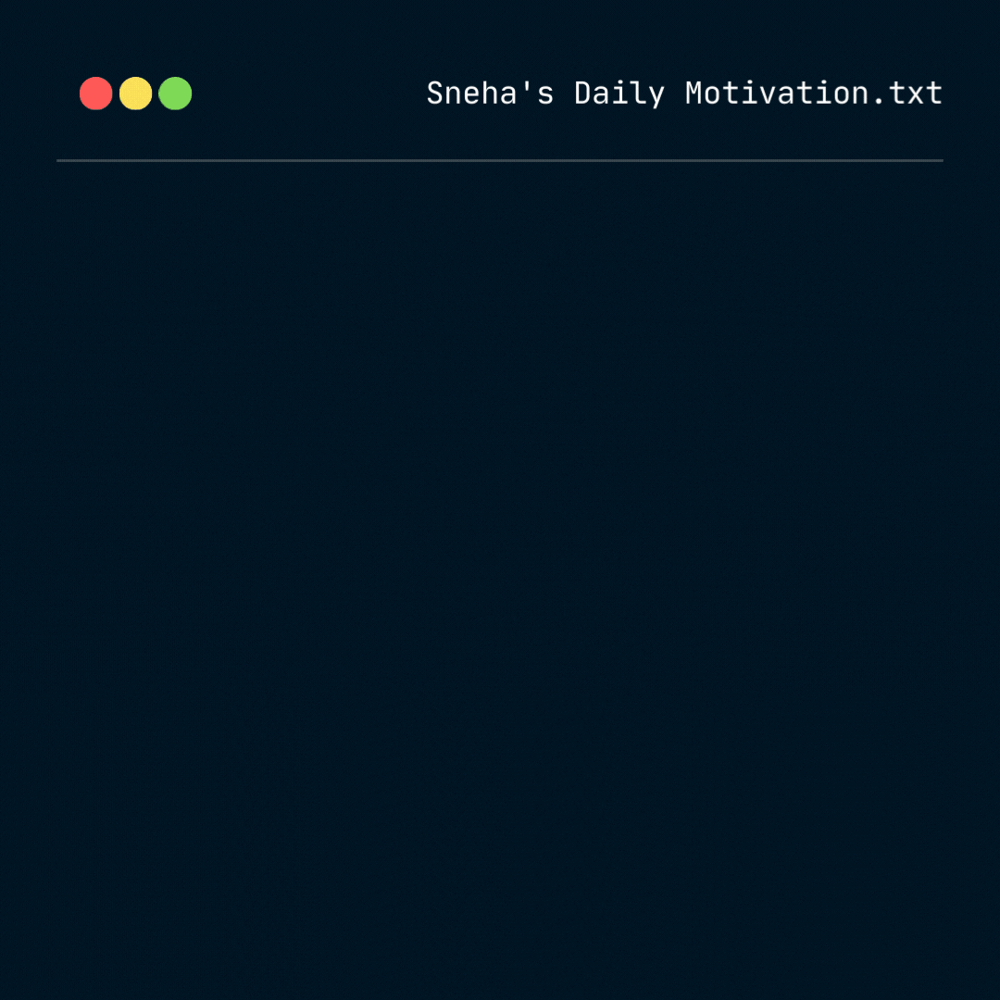

## Hi there! I'm Snehitha Barukula  

### My Portfolio 👩‍💻
- 👩‍💻 Currently pursuing Masters in CS at Northeastern University
- 📚 Worked as an application engineer at IDFC FIRST BANK 
- 👩‍🎓 Graduated from SRM University AP, class of 2018
- 👩‍🎓 I finished my semester abroad program from University of California Davis
- 😄 Pronouns: She/Her
- ⚡ Fun fact: I love to paint and I enjoy playing badminton 

### 🧰 Languages and Tools
I specialize in software development and AI-driven solutions, with expertise in:

- Programming Languages: Python, Java, C, C++, SQL, TypeScript
- Data Science and Machine Learning: TensorFlow, PyTorch, Keras, Pandas, NumPy, Scikit-learn, NLP, Computer Vision
- Web Development: React, AngularJS, NodeJS, HTML, CSS, JavaScript
- Cloud and DevOps: AWS Glue, AWS S3, Jenkins, Kubernetes, Docker
- Database Management: SQL, MongoDB
- Software Development: Object-Oriented Programming, Data Structures, Algorithms

I thrive in AGILE environments, focusing on building innovative, secure, and scalable solutions. My strengths lie in problem-solving, collaboration, and a disciplined approach to project management and compliance.

My strengths lie in problem-solving, creative thinking, and collaboration, enabling me to excel in both individual and team settings. I am deeply passionate about leveraging technology to solve real-world challenges, whether through building AI-driven patient risk prediction systems, smart city waste management solutions, or improving software reliability through automation and optimization.

Let’s connect to discuss how we can collaborate on impactful, cutting-edge technology projects!
  
### Contact Me On

				      

